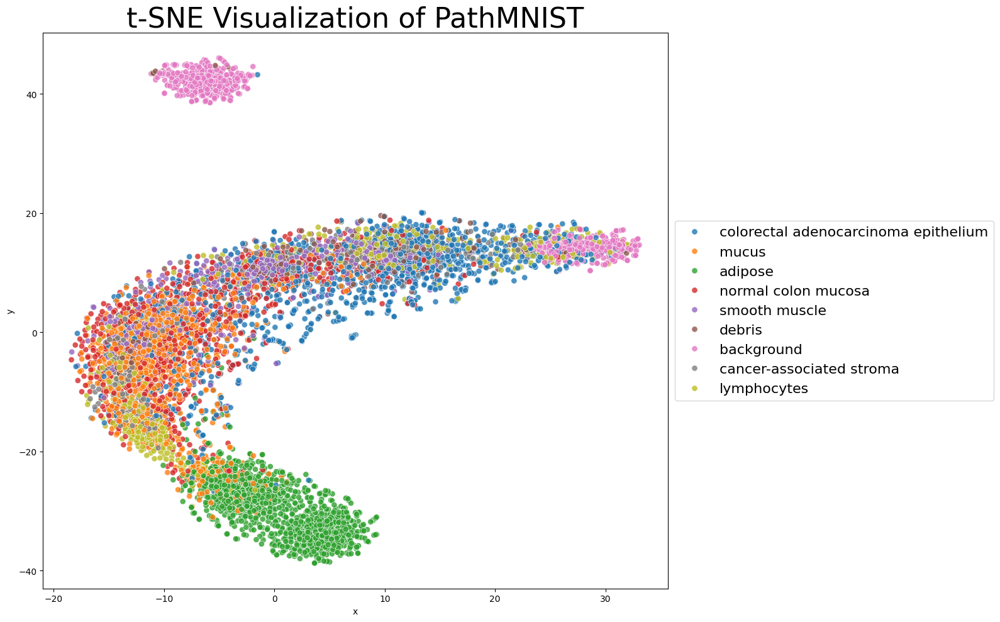
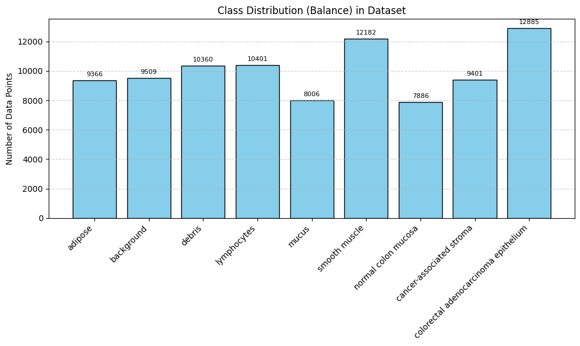
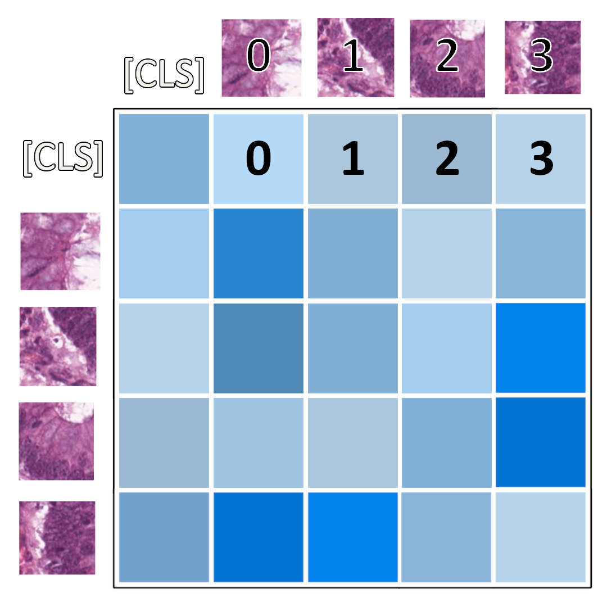
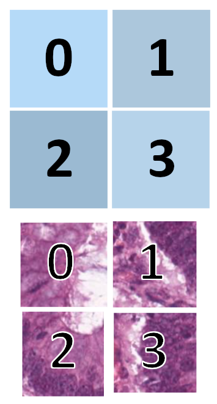
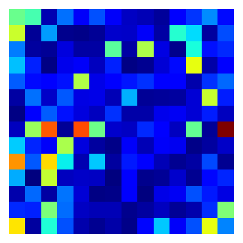
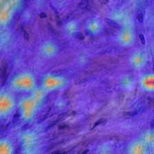

# PathMNIST

**PathMNIST** is a part of **MedMNIST** – a collection of standardized biomedical image datasets designed for lightweight deep learning benchmarking. PathMNIST focuses on histopathological image classification of colorectal cancer using hematoxylin and eosin (H&E) stained images.

## General Characteristics

PathMNIST consists of RGB image patches resized to 3×28×28 pixels. These are derived from original high-resolution histopathology slides and have been standardized to reduce preprocessing effort and computational load.

- **Modality:** Histopathology (H&E stained)
- **Total Samples:** 107,180
- **Type:** Multiclass classification
- **License:** CC BY 4.0

## Dataset Origin

The PathMNIST dataset was created by preprocessing tiles from:

- NCT-CRC-HE-100K dataset (originally 224×224 px)
- Sourced from National Center for Tumor Diseases (NCT), Heidelberg, and UMM, Mannheim

All images were center-cropped and resized to 28×28 RGB format for lightweight usage.

## Data Splits

| Split      | Number of Samples |
|------------|------------------:|
| Train      | 89,996            |
| Validation | 10,004            |
| Test       | 7,180             |
| **Total**  | **107,180**       |

## Classes

This dataset has 9 classes representing different tissue types and elements in colorectal histology:

| Label | Tissue Type                        |
|-------|------------------------------------|
| 0     | Adipose                            |
| 1     | Background                         |
| 2     | Debris                             |
| 3     | Lymphocytes                        |
| 4     | Mucus                              |
| 5     | Smooth muscle                      |
| 6     | Normal colon mucosa                |
| 7     | Cancer-associated stroma           |
| 8     | Colorectal adenocarcinoma epithelium |

## EDA
### t-SNE

###  Balance

## Benchmark Results

| Model             | ROC AUC | Accuracy |
|-------------------|---------|----------|
| ResNet-18         | 0.983   | 90.7%    |
| XGBoost           | 0.931   | 64.73%   |
| Vision Transformer| 0.998   | 97.63%   |

## Raw attention visualization
You can visualize raw attention with attention matrix

By using the first row values:

In our case such visualization may look like:

and we can overlay it to get:

